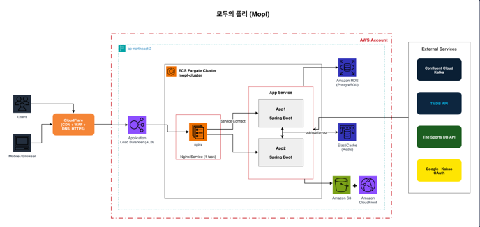
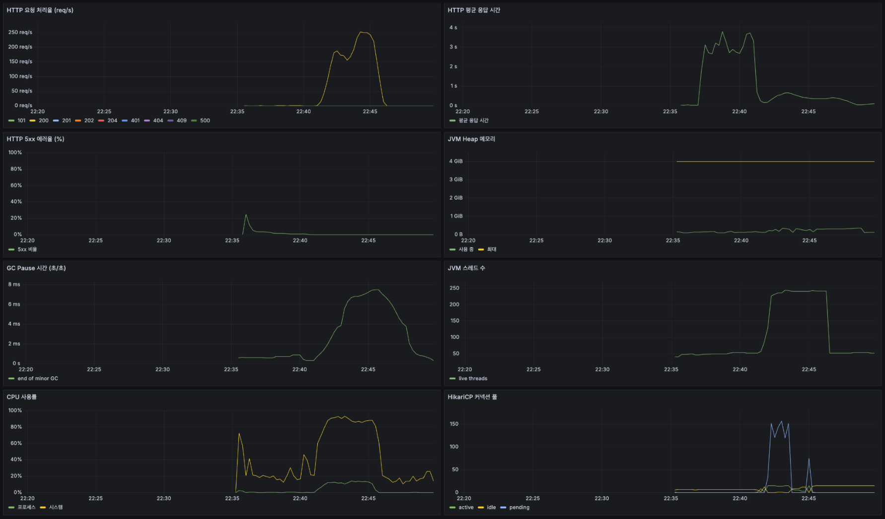

# 모두의 플리
# 파트4-2팀

[](https://codecov.io/gh/sb10-part04-team02/sb10-mopl-team02?branch=main)

## [팀 노션 페이지 링크](https://tar-sandwich-ba0.notion.site/_-04_-02-404f1e38171183698be38177e52096db?pvs=74)

## 팀원 구성

박승민 ([@raonPsm](https://github.com/raonPsm))  
이승민 ([@chosi123](https://github.com/chosi123))  
임지호 ([@jiho0420](https://github.com/jiho0420))  
조성진 ([@Amperisk9](https://github.com/Amperisk9))  
최종인 ([@jonginCh](https://github.com/jonginCh))

---

## 프로젝트 소개

- 영화/TV/스포츠 콘텐츠에 대한 평가 및 큐레이션과, 실시간 함께보기(공동 시청, 콘텐츠 채팅, DM, 팔로우, 알림) 소셜 기능을 제공하는 플랫폼의 Spring 백엔드 시스템 구축
- 프로젝트 기간: 2026.06.18 ~ 2026.07.29

---

## 기술 스택

**Backend**


**Real-time / Messaging**


**Database / Storage**


**Mapping / Docs**


**Observability**


**Infra / CI-CD**


**공통 Tool**


---

## 시스템 아키텍처



---

## API / 아키텍처 개요

- REST API: Controller → Service → Repository 계층, JWT Bearer 인증. API 명세는 [배포된 Swagger UI](https://api.mopl2.cloud/swagger-ui.html) 참고
- 인증(로그인)
    - 자체 로그인(이메일/비밀번호) + OAuth2/OIDC 소셜 로그인(Google, Kakao) 지원
    - 소셜 로그인 시작: `GET /oauth2/authorization/{google|kakao}`
    - 로그인 성공 시 JWT 발급, 이후 요청은 `Authorization: Bearer <accessToken>` 헤더로 인증
    - 역할은 `USER`/`ADMIN`, 관리자 계정은 앱 기동 시 자동 초기화되며 역할 변경·계정 잠금 시 해당 사용자는 강제 로그아웃
- WebSocket/STOMP (`/ws`, 핸드셰이크 헤더에 액세스 토큰 필요)
    - `/sub/contents/{id}/watch` — 공동 시청(함께보기)
    - 구독: `/sub/contents/{id}/chat`, 발행: `/pub/contents/{id}/chat` — 콘텐츠 채팅 (미영속)
    - 구독: `/sub/conversations/{id}/direct-messages`, 발행: `/pub/conversations/{id}/direct-messages` — DM
- SSE (`/api/sse`) — 알림(`notifications`), 비활성 대화 DM(`direct-messages`) 실시간 전달

---

<details>
<summary><span style="font-size: 1.5em; font-weight: bold;">로컬에서 애플리케이션 실행하기</span></summary>
<div markdown="1">

아래는 로컬 PC에서 이 프로젝트를 빌드/실행/테스트하는 데 필요한 절차입니다 (배포 환경 설정이 아닙니다).

### 사전 요구사항
- JDK 17
- Docker / Docker Compose

### 1. 환경 변수 설정
(.env 파일을 열어 필수 값 입력)
```bash
cp .env.example .env
```

### 2. 인프라 실행 (PostgreSQL · Redis)

#### 시작 - 빌드 + 백그라운드 실행
```bash
docker compose --env-file .env up -d --build
```

#### 상태 / 로그 확인
```bash
docker compose ps   # 컨테이너 상태
```
```bash
mkdir -p logs/db && docker compose logs -f db | tee logs/db/$(date +%Y%m%d_%H%M%S).log   # DB 로그 (실시간 + 저장)
```
```bash
mkdir -p logs/redis && docker compose logs -f redis | tee logs/redis/$(date +%Y%m%d_%H%M%S).log   # Redis 로그
```

#### 종료
```bash
docker compose down   # 중지 (데이터 보존)
```
```bash
docker compose down -v   # 중지 + DB 초기화 (볼륨 삭제)
```

### 3. 애플리케이션 실행

```bash
mkdir -p logs/app && set -a && source .env && set +a && ./gradlew bootRun 2>&1 | tee logs/app/$(date +%Y%m%d_%H%M%S).log    
```

프로파일을 명시적으로 지정해 실행 (dev가 기본값이라 보통 생략 가능)
```bash
./gradlew bootRun --args='--spring.profiles.active=dev'
```

실행 후 Swagger UI: http://localhost:8080/swagger-ui.html

### 3-1. 로컬 ELK 로그 수집 (선택)

dev 프로파일 앱 로그를 Kibana에서 검색/필터링할 수 있습니다.
수집 경로: 앱(logback JSON) --TCP 5000--> Logstash --> Elasticsearch(9200) --> Kibana(5601)

#### 시작 / 종료
```bash
docker compose -f docker-compose-elk.yml up -d     # ES + Logstash + Kibana 기동
```
```bash
docker compose -f docker-compose-elk.yml down      # 종료 (볼륨 없음 = 로그 데이터 초기화)
```

#### Kibana 조회
- data view(`mopl-logs-*`)는 기동 시 `kibana-init` 컨테이너가 자동 생성합니다 (재기동 때마다 복구, 이미 있으면 스킵).
- http://localhost:5601 -> **Discover**에서 로그 조회 (`requestId`, `app`, `level` 등으로 필터링)

> - ELK가 꺼져 있어도 앱은 정상 동작합니다. 전송 appender가 비동기라 콘솔 로그만 남고 초과분은 드롭됩니다.
> - Linux에서는 Elasticsearch 기동에 `sudo sysctl -w vm.max_map_count=262144`가 필요할 수 있습니다.
> - macOS에서 포트 5000이 AirPlay Receiver와 충돌하면 `docker-compose-elk.yml`의 매핑을 `5001:5000`으로 바꾸고 `LOGSTASH_PORT=5001`로 실행하세요.

### 3-2. 전체 로컬 QA 절차 (Kafka 포함)

#### 1) 인프라 기동
```bash
docker compose -f docker-compose.distributed.yml up -d kafka   # Kafka 브로커 (localhost:9092)
docker compose --env-file .env up -d --build                   # PostgreSQL + Redis
docker compose -f docker-compose-elk.yml up -d                 # ELK (선택)
```

#### 2) 앱 실행
```bash
mkdir -p logs/app && set -a && source .env && set +a && ./gradlew bootRun 2>&1 | tee logs/app/$(date +%Y%m%d_%H%M%S).log
```

#### 3) QA 진행
Swagger UI(http://localhost:8080/swagger-ui.html) 등에서 기능 테스트

#### 4) 정리
```bash
docker compose down                                     # PostgreSQL + Redis 중지 (데이터 보존)
docker compose -f docker-compose-elk.yml down           # ELK 중지
docker compose -f docker-compose.distributed.yml down   # Kafka 중지
```

### 4. 빌드

```bash
./gradlew build   # 컴파일 + 테스트 + 패키징 (최초 build 시 Git pre-commit 훅 자동 설치)
```
```bash
./gradlew clean build   # 클린 후 전체 빌드
```

> `build` 태스크는 `installGitHooks`에 의존해, 최초 빌드 시 `config/git-hooks`의 pre-commit 훅(커밋 시 `spotlessApply` 자동 실행)이 `.git/hooks`로 설치됩니다.

### 5. 테스트 & 커버리지

```bash
./gradlew test   # 전체 테스트
```
```bash
./gradlew test --tests 'com.team02.mopl.SomeTest'   # 단일 테스트 클래스
```
```bash
./gradlew test --tests 'com.team02.mopl.SomeTest.method'   # 단일 테스트 메서드
```

```bash
./gradlew jacocoTestReport   # 커버리지 HTML/XML 리포트 생성
```
```bash
./gradlew jacocoTestCoverageVerification   # 최소 커버리지(80%) 검증
```

- 커버리지 리포트: `build/reports/jacoco/test/html/index.html`

> 테스트 프로파일(`test`)은 Testcontainers로 PostgreSQL 컨테이너를 자동으로 띄워 실행합니다. Docker가 실행 중이어야 합니다.
> `test` 실행 후 `jacocoTestReport`가 자동으로 이어서 실행됩니다. QueryDSL/MapStruct 자동생성 코드는 커버리지 측정에서 제외됩니다.

### 6. 코드 품질 검사

```bash
./gradlew spotlessApply   # 코드 포맷 자동 적용 (Google Java Format)
```
```bash
./gradlew spotlessCheck   # 포맷 위반 검사 (수정 없이 확인만)
```
```bash
./gradlew spotbugsMain   # 정적 분석 (버그 패턴 탐지)
```
```bash
./gradlew check   # 전체 검증 (test + spotlessCheck + spotbugs 등 통합)
```

- SpotBugs 리포트: `build/reports/spotbugs/main.html`

### 7. 모니터링 (Prometheus / Grafana) 로컬 확인

`docker compose up -d`(2번)로 인프라를 띄우면 Prometheus, Grafana 컨테이너도 함께 실행됩니다.
Prometheus는 호스트에서 실행 중인 앱(`host.docker.internal:8080`)의 `/actuator/prometheus`를 스크레이프하므로,
**메트릭이 수집되려면 3번의 애플리케이션(`./gradlew bootRun`)이 실행 중이어야 합니다.**

#### 확인 순서

1. 앱 메트릭 노출 확인
   ```bash
   curl -s http://localhost:8080/actuator/prometheus | head   # 메트릭 텍스트가 나오면 정상
   ```
2. Prometheus 타깃 상태 확인
   - http://localhost:9090/targets 접속 -> `mopl` job이 **UP**이면 스크레이프 정상
   - 쿼리 예: http://localhost:9090 에서 `up{job="mopl"}` 실행 시 값이 `1`
3. Grafana 대시보드 확인
   - http://localhost:3000 접속 (기본 계정 `admin` / `admin`, `.env`의 `GRAFANA_ADMIN_USER` / `GRAFANA_ADMIN_PASSWORD`로 오버라이드 가능)
   - 좌측 메뉴 **Dashboards -> Mopl -> "Mopl 서버 모니터링"** 대시보드에서 HTTP 요청 처리율/응답 시간 등 확인
   - 데이터소스(Prometheus)와 대시보드는 `config/monitoring/grafana`에서 자동 프로비저닝됩니다.



| 서비스 | 주소 | 비고 |
| --- | --- | --- |
| 앱 메트릭 | http://localhost:8080/actuator/prometheus | 호스트에서 `bootRun`으로 실행 |
| Prometheus | http://localhost:9090 | `/targets`에서 스크레이프 상태 확인 |
| Grafana | http://localhost:3000 | admin/admin, 대시보드 자동 로드 |

> `include: health, info, prometheus`로 지정된 actuator 엔드포인트만 노출되며, 나머지는 `SecurityConfig`에서 차단됩니다.
> 타깃이 **DOWN**이면 앱이 호스트에서 실행 중인지(2번이 아닌 3번), `8080` 포트가 열려 있는지 확인하세요.

### 8. 부하 테스트 (k6)

[`load-test/`](load-test/README.md)에 k6 기반 부하테스트가 구성되어 있습니다. 실행 프로파일(smoke/load/stress), 인증, 커서 순회, 시딩 절차가 공통 모듈로 준비되어 있어 시나리오 파일 하나만 추가하면 새 부하테스트를 만들 수 있습니다.

- 시나리오: 콘텐츠 조회, 리뷰 조회/작성, 플레이리스트 조회, 구독 작성, 알림 조회, 팔로우-알림 파이프라인, 비밀번호 재설정 등
- k6 메트릭을 Prometheus remote write로 전송해 기존 Grafana 스택에서 **k6 부하테스트** 대시보드로 실시간 확인 가능
- 자세한 실행 방법과 시나리오별 설명은 [`load-test/README.md`](load-test/README.md) 참고

</div>
</details>

---

## 협업 컨벤션

- 브랜치: `<type>/#<이슈번호>/<설명>` (예: `feat/#1/coderabbitai`). `type`은 `feat/fix/refactor/docs/test/chore`
- PR: `dev` 브랜치로 대상 지정, `main`은 릴리즈 브랜치
- 코드 리뷰: CodeRabbit이 PR을 한국어(`assertive` 프로필)로 자동 리뷰 (`.coderabbit.yml`)
- 커밋 메시지: Conventional Commit 스타일 + 한국어 (`feat:`, `fix:`, `chore:`, `docs:` 등)
- PR/이슈 종료 시 Discord로 알림 (`.github/workflows/pr-discord-notify.yml`)

---

## 팀원별 구현 기능 상세

### 박승민

- **콘텐츠 데이터 관리**
    - Spring Batch 기반 배치 처리로 외부 API(TMDB, The Sports DB) 콘텐츠 수집/적재
    - 주기 스케줄러 + 중복 실행 방지 락, 커서 기반 backfill로 과거 데이터 점진 수집
    - 콘텐츠 CRUD 및 조회(타입 필터, 정렬, 커서 페이지네이션) API

### 이승민

- **실시간 함께보기 (공동 시청)**
    - WebSocket/STOMP 기반 콘텐츠 동시 시청 기능
- **콘텐츠 채팅**
    - 콘텐츠별 실시간 채팅 (WebSocket, 비영속)
- **DM (다이렉트 메시지)**
    - 실시간 DM 송수신 및 대화 영속화

### 임지호

- **평가/큐레이팅 도메인**
    - 리뷰 작성·수정·삭제 및 콘텐츠 평점·리뷰 수 집계
    - 플레이리스트 생성·수정·삭제, 콘텐츠 추가·삭제, 구독/구독 취소 API
    - 리뷰·플레이리스트 목록 커서 페이지네이션 조회
- **AWS 인프라 구성 / 배포**
    - ECS Fargate(ARM64) 운영 환경 구축, nginx·app 서비스 분리 + Service Connect로 app 인스턴스 요청 분산
    - CloudFlare → ALB(HTTPS/ACM) → nginx → app 엣지 TLS 구성, RDS·ElastiCache·Kafka·S3/CloudFront 연동
    - Flyway 도입으로 DB 스키마 마이그레이션 자동화
- **CI/CD 파이프라인**
    - CI: Spotless·SpotBugs 검사, 테스트, JaCoCo 커버리지 검증
    - CD: `dev` push 시 자동 배포. GitHub OIDC 인증, ECR 푸시 → 태스크 정의 등록 → ECS 서비스 업데이트
    - circuit breaker 자동 롤백 및 배포 결과 검증

### 조성진

- **사용자 관리**
    - 회원가입/조회/수정 등 사용자 도메인 API
- **인증/인가**
    - Custom FilterChain 및 AuthenticationProvider 기반 인증/인가 파이프라인 구축
    - OAuth2 기반 Google, Kakao OIDC 로그인 파이프라인 구축

### 최종인

- **알림 / SSE**
    - 알림 발행 및 SSE 기반 실시간 알림 전달
    - Kafka 이벤트 처리 및 Redis Pub/Sub 기반 SSE fan-out 구현

- **프로필 / 팔로우**
    - 프로필 조회, 팔로우/언팔로우 및 팔로우 알림
    - 팔로우 상태 조회 API 계약 검증 및 배포 환경 QA

---

## 파일 구조

```markdown
com.team02.mopl
├── domain
│   ├── auth            # 인증/인가, JWT, OAuth 로그인
│   │   ├── controller / service / dto / entity / exception
│   │   ├── jwt
│   │   ├── login
│   │   └── oauth
│   ├── content          # 콘텐츠(영화/TV/스포츠) CRUD, TMDB/스포츠 DB 배치 수집
│   │   ├── controller / service / repository / mapper / dto / entity / enums / util / exception
│   │   └── ingestion
│   ├── contentchat       # 콘텐츠 채팅 (WebSocket, 미영속)
│   │   └── controller / service / dto / exception
│   ├── dm                # 다이렉트 메시지
│   │   ├── controller / service / repository / dto / entity / enums / util / exception
│   │   └── redis
│   ├── follow            # 팔로우
│   │   ├── controller / service / repository / dto / entity / exception
│   │   └── event
│   ├── notification       # 알림 (SSE)
│   │   ├── controller / service / repository / dto / entity / enums / util / exception
│   │   ├── kafka
│   │   └── redis
│   ├── playlist           # 플레이리스트, 구독
│   │   ├── controller / service / repository / mapper / dto / entity / enums / util / exception
│   │   └── event
│   ├── review             # 리뷰/평점
│   │   └── controller / service / repository / mapper / dto / entity / enums / util / exception
│   ├── sse                # SSE 연결 관리
│   │   └── controller / service / repository
│   ├── subscription       # 플레이리스트 구독
│   │   ├── controller / service / repository / entity / exception
│   │   └── event
│   ├── user               # 회원
│   │   ├── controller / service / repository / mapper / dto / entity / enums / exception / util
│   │   └── outbox
│   └── watching           # 공동 시청 (WebSocket)
│       ├── controller / service / repository / mapper / dto / entity / enums / exception / util
│       ├── event
│       └── websocket
│
└── global
    ├── config             # Spring 설정 (Security, WebSocket, Swagger 등)
    ├── entity             # BaseEntity 등 공통 엔티티
    ├── enums
    ├── exception          # 전역 예외 처리 (@RestControllerAdvice)
    ├── dto                # 공통 DTO (CursorResponse 등)
    ├── kafka
    ├── outbox
    ├── redis
    ├── storage
    ├── logging
    ├── alert
    ├── init               # 관리자 계정 자동 초기화 등
    ├── websocket
    └── util
```

---

## 구현 홈페이지

https://api.mopl2.cloud/

---

## 프로젝트 회고록

https://tar-sandwich-ba0.notion.site/367f1e381711804cacb5c883f1a165f3?v=367f1e38171180a09942000c2356eae1
